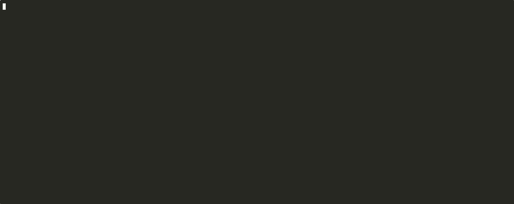

<p align="center">
  
</p>

<h1 align="center">Lurkr</h1>

<p align="center">
  <a href="LICENSE"></a>
  <a href="https://pypi.org/project/lurkr/"></a>
  <a href="https://github.com/agentveil-protocol/lurkr/actions/workflows/posture-self-test.yml"></a>
  <a href="https://www.python.org/downloads/"></a>
  <a href="https://github.com/agentveil-protocol/lurkr/stargazers"></a>
  <a href="#use-as-a-github-action"></a>
  <a href="#hard-constraints"></a>
  <a href="#privacy--data-handling"></a>
  <a href="https://asciinema.org/a/fWtgojrBf8gEJBak"></a>
</p>

<p align="center">
  <strong>Find what your agent can touch before you deploy it.</strong>
</p>

<p align="center">
  <a href="https://asciinema.org/a/fWtgojrBf8gEJBak"></a>
</p>

Static, local-only scanner for risky AI agent capabilities. No telemetry, no code execution, redacted output.

`lurkr` is a pre-deployment, static, local-only scanner that flags risky
AI-agent and GitHub-workflow capability issues. No telemetry, no network
calls, no project code execution. v0.2.6 includes fourteen high-severity rules across
GitHub workflows, agent manifests, identity files, and bounded Python
agent-source analysis.

[Quick Start](#quick-start) |
[Privacy & data handling](#privacy--data-handling) |
[What a finding looks like](#what-a-finding-looks-like) |
[Detection scope](#detection-scope-v025) |
[GitHub Action](#use-as-a-github-action) |
[Why this exists](#why-this-exists)

---

## Quick Start

```bash
pip install lurkr
lurkr scan --path . --output report.json
cat report.json
```

That is the whole flow. The scanner is read-only: it does not modify your
files, run your code, or send data over the network.

Python agent detection is enabled for bounded `.py` source analysis.

To fail CI when findings meet a threshold, add `--fail-on`:

```bash
lurkr scan --path . --output report.json --fail-on high
```

For existing repositories, create a baseline first so CI only fails on new
findings:

```bash
lurkr scan --path . --save-baseline .lurkr-baseline.json
lurkr scan --path . --baseline .lurkr-baseline.json --fail-on high
```

## Privacy & Data Handling

Lurkr is local-only by design.

- It does not upload source code, manifests, scan reports, findings, paths, or
  usage data to AgentVeil.
- It does not make network calls during `lurkr scan`.
- It does not execute scanned project code.
- It writes output only to the terminal or to the report path you provide.
- Reports are redacted: raw secrets, command bodies, private-key bytes, and
  credential material are not included.

If you use the optional GitHub Action, the scan still runs inside your CI
environment. Any SARIF upload is performed by GitHub's own CodeQL upload action
only when you add that step to your workflow.

## What a Finding Looks Like

```json
{
  "rule_id": "workflow.deploy_without_approval",
  "severity": "high",
  "file": ".github/workflows/deploy.yml",
  "line": 12,
  "message": "Deployment workflow appears to run without an approval gate.",
  "remediation": "Add a protected GitHub environment or explicit manual approval before production deploy, release, or publish steps."
}
```

Every finding contains rule ID, severity, repository-relative file path, line
number when available, redacted message, and remediation pointer. Raw secrets,
command bodies, and key material never appear in the report.

## Detection Scope (v0.2.6)

All current rules are reported as `high` severity.

| Rule | What it flags | Scope |
|---|---|---|
| [`bypass.direct_github_token`](https://github.com/agentveil-protocol/lurkr/blob/main/docs/rules/bypass.direct_github_token.md) | Direct GitHub PAT/token references in workflows or agent manifests | GitHub Actions, agent manifests |
| [`workflow.deploy_without_approval`](https://github.com/agentveil-protocol/lurkr/blob/main/docs/rules/workflow.deploy_without_approval.md) | Deploy/release/publish steps without an approval gate | GitHub Actions |
| [`workflow.pull_request_target_secrets_risk`](https://github.com/agentveil-protocol/lurkr/blob/main/docs/rules/workflow.pull_request_target_secrets_risk.md) | `pull_request_target` workflows that combine privileged context with checkout, run, or secrets | GitHub Actions |
| [`tool.shell_without_approval`](https://github.com/agentveil-protocol/lurkr/blob/main/docs/rules/tool.shell_without_approval.md) | Agent tool manifests that enable shell execution without an approval flag | MCP/CrewAI-style manifests |
| [`identity.private_key_unencrypted`](https://github.com/agentveil-protocol/lurkr/blob/main/docs/rules/identity.private_key_unencrypted.md) | Unencrypted PEM private key files committed to the repo | Repository files |
| [`agent.credential_to_llm_context`](https://github.com/agentveil-protocol/lurkr/blob/main/docs/rules/agent.credential_to_llm_context.md) | Credential-bearing values passed into LLM completion context | OpenAI, Anthropic, Gemini, LangChain direct call sites |
| [`agent.declared_vs_imported_delta`](https://github.com/agentveil-protocol/lurkr/blob/main/docs/rules/agent.declared_vs_imported_delta.md) | Python tool registrations not declared in agent manifest files | MCP, CrewAI, AutoGen, LangChain manifests + supported Python tool registrations |
| [`agent.dynamic_prompt_from_user_input`](https://github.com/agentveil-protocol/lurkr/blob/main/docs/rules/agent.dynamic_prompt_from_user_input.md) | Prompt templates directly interpolating function parameters | Prompt-shaped Python assignments and common template helpers |
| [`agent.python_api_key_hardcoded`](https://github.com/agentveil-protocol/lurkr/blob/main/docs/rules/agent.python_api_key_hardcoded.md) | API-key-shaped string literals in Python source | Module-wide; Anthropic, OpenAI, GitHub PAT, HuggingFace |
| [`agent.python_eval_exec_in_tool`](https://github.com/agentveil-protocol/lurkr/blob/main/docs/rules/agent.python_eval_exec_in_tool.md) | `eval`/`exec`-style dynamic execution inside Python tool functions | Supported Python tool functions |
| [`agent.python_subprocess_in_tool`](https://github.com/agentveil-protocol/lurkr/blob/main/docs/rules/agent.python_subprocess_in_tool.md) | Subprocess or shell calls inside supported Python tool functions | Supported Python tool functions |
| [`agent.python_tool_without_approval`](https://github.com/agentveil-protocol/lurkr/blob/main/docs/rules/agent.python_tool_without_approval.md) | Python agent tool declarations without an approval marker | LangChain, LangGraph, CrewAI, MCP, OpenAI tool calling, Anthropic tool use, LlamaIndex, Gemini |
| [`agent.python_unrestricted_file_access`](https://github.com/agentveil-protocol/lurkr/blob/main/docs/rules/agent.python_unrestricted_file_access.md) | File write or delete calls inside Python tool functions | Supported Python tool functions |
| [`agent.unverified_mcp_endpoint`](https://github.com/agentveil-protocol/lurkr/blob/main/docs/rules/agent.unverified_mcp_endpoint.md) | MCP server URLs pointing to non-allowlisted external hosts | MCP manifests |

Deployment checks include common CLI deploy, release, registry push, and
infrastructure apply commands. Build, preview, plan, and package-only commands
are excluded unless the same step also contains a deploy marker.

## How Lurkr is different

Most AI-agent scanners focus on installed components, MCP servers, prompts, or skills.

Lurkr focuses on **capability risk before deployment**.

It scans the repo surfaces that turn an agent into an actor:
- GitHub workflows that can deploy or expose secrets
- Agent manifests that expose shell-capable tools
- Python agent code that wires tools to subprocess, file writes, eval/exec, direct tokens, LLM context, prompts, or external MCP endpoints

Static. Local-only. Offline. Redacted by default.

The goal: find high-severity capabilities worth controlling before they become production incidents — not produce a giant list of theoretical issues.

| Most scanners | Lurkr |
|---|---|
| MCP servers / installed components | Repo surfaces about to be deployed |
| Prompt injection / prompt risk | Risky agent capabilities |
| Long lists of potential issues | Conservative high-severity rules |
| API tokens / cloud calls | Local, offline, no telemetry |
| Generic secrets | Agent-relevant credentials and bypass paths |
| Report only | Findings mapped to remove / restrict / redact controls |
| Ad-hoc detection logic | Rules grounded in Saltzer-Schroeder principles (1975), Schneier attack trees (1999), OWASP LLM Top 10, MITRE ATLAS |

## Roadmap

### Available now (v0.2.6)

14 high-severity rules across:
- GitHub workflows + agent manifests + identity files
- Python agent code: LangChain / LangGraph, CrewAI, MCP (FastMCP and Server-style), OpenAI tool calling, Anthropic tool use, LlamaIndex, Gemini
- Declared-vs-imported capability delta checks across MCP/CrewAI/AutoGen/LangChain manifests and Python tool registrations
- AI-specific static checks for credential flow into LLM context, direct prompt interpolation, and external MCP endpoints
- Baseline mode for CI adoption: save current findings, then fail only on new findings

### v0.3.0 — broader framework coverage

Candidates for broader framework coverage:
- AutoGen / AG2 (re-validation against current Microsoft direction)
- PydanticAI
- Semantic Kernel

### v0.4.0+ — quality and ergonomics

Roadmap items being considered:
- Auto-fix patches via SARIF `fixes` field
- Per-finding contextual remediation
- Suppression comments / inline `lurkr: ignore`
- Cross-file `Tool(func=external_module.helper)` resolution
- More manifest formats (mcp.json variants)

### Community input welcome

Open an issue with framework or rule requests. Real-world examples accelerate prioritization.

## Install

<details>
<summary><b>From PyPI (recommended)</b></summary>

```bash
pip install lurkr
```

</details>

<details>
<summary><b>From GitHub release</b></summary>

```bash
pip install git+https://github.com/agentveil-protocol/lurkr@v0.2.6
```

</details>

<details>
<summary><b>From source (development)</b></summary>

```bash
git clone https://github.com/agentveil-protocol/lurkr
cd lurkr
pip install -e .
```

</details>

<details>
<summary><b>Docker</b></summary>

```bash
docker build -t lurkr .
docker run --rm -v "$PWD:/workspace" lurkr --output /workspace/report.json
```

The container runs as a non-root user (UID 1000). For host UID/GID matching to
avoid permission issues with the generated report file:

```bash
docker run --rm -u $(id -u):$(id -g) -v "$PWD:/workspace" lurkr --output /workspace/report.json
```

Add `--fail-on high` to make the container exit non-zero when high findings are
present.

</details>

## Use as a GitHub Action

Use the action from the same repository:

```yaml
- uses: agentveil-protocol/lurkr@v0.2.6
  with:
    path: "."
    output: lurkr-report.json
    fail-on: high
```

The action requires Python 3.10 or newer on the runner. It writes the report
path to the `report` output and does not upload data to AgentVeil. Omit
`fail-on` to keep review-only behavior.

For existing repositories, commit a baseline and only fail on new findings:

```yaml
- uses: agentveil-protocol/lurkr@v0.2.6
  with:
    path: "."
    output: lurkr-report.json
    baseline: ".lurkr-baseline.json"
    fail-on: high
```

For GitHub Code Scanning, write SARIF and upload it with CodeQL:

```yaml
- uses: agentveil-protocol/lurkr@v0.2.6
  with:
    path: "."
    output: lurkr.sarif
    format: sarif

- uses: github/codeql-action/upload-sarif@v3
  with:
    sarif_file: lurkr.sarif
```

## Pre-commit Hook

Run Lurkr as a [pre-commit](https://pre-commit.com) hook to catch capability
issues before they reach the remote.

Add to your `.pre-commit-config.yaml`:

```yaml
repos:
  - repo: https://github.com/agentveil-protocol/lurkr
    rev: v0.2.6
    hooks:
      - id: lurkr
        args: ["--fail-on", "high"]
```

Then install:

```bash
pre-commit install
```

The hook generates `lurkr-report.json` on every commit. Omit `args` for
review-only behavior, or use `--fail-on` to block commits when findings meet
the selected threshold.

## Triaging Findings

`lurkr` flags **capability surfaces**: places where an AI agent or workflow has
direct capability to do something risky. Most findings are **review items**,
not incidents:

- **`bypass.direct_github_token`** commonly appears on stale-bots,
  release-bots, CI publish steps, and label-management workflows that
  legitimately use the auto-injected `secrets.GITHUB_TOKEN`. The rule fires
  by design: the workflow holds direct GitHub write capability and that is a
  capability surface worth surfacing, even when expected.
- **`workflow.deploy_without_approval`** may flag deploy paths that have
  approval mechanisms the static scanner cannot see, such as manual job
  dispatch, branch protection, or external reviewer chains. Verify against
  your actual approval flow before treating as incident.
- **`workflow.pull_request_target_secrets_risk`** flags risky combinations,
  but some `pull_request_target` workflows are correctly scoped to label-only
  or metadata-only operations. Re-check the actual job content.
- **`tool.shell_without_approval`** flags inline shell capability
  declarations. Tools referenced by name, such as `search_tool` in CrewAI,
  are not detected; only literal `shell:` or `bash:` keys are.
- **`identity.private_key_unencrypted`** is the most reliably actionable
  finding: committed unencrypted private keys are usually real issues.
- **`agent.python_tool_without_approval`** flags supported Python tool
  declarations where the scanner cannot see a conservative approval marker.
- **`agent.python_subprocess_in_tool`** and
  **`agent.python_eval_exec_in_tool`** are high-priority review items because
  agent-callable Python functions can run commands or dynamic code.
- **`agent.python_unrestricted_file_access`** flags file write/delete calls in
  tool functions. Review whether the path is intentionally constrained.
- **`agent.python_api_key_hardcoded`** is module-wide and should usually be
  treated like a secret-handling issue: remove and rotate the key if real.

Use Lurkr to surface review items for human triage, not to auto-block CI or
replace SAST/secret-scanning tools.

## Why This Exists

AI agents increasingly touch production credentials, deploy workflows, and
developer infrastructure. Lurkr is the first step: find risky capabilities
before deployment and before they become incidents.

```text
  +----------+      +----------+      +----------+
  |   FIND   |      |  DECIDE  |      |  PROVE   |
  |  risky   | ---> |  what is | ---> |  what    |
  |   caps   |      |  allowed |      | happened |
  +----------+      +----------+      +----------+
   you are here       roadmap          roadmap
   v0.2 Lurkr
```

| | Lurkr does | Lurkr does not |
|---|---|---|
| Scope | Static analysis and capability risk patterns | Approval, blocking, or execution of agent actions |
| Effects | Read-only file inspection | Code execution, network calls, or file mutation |
| Output | Redacted JSON findings | Secret values, command bodies, or key bytes |

For the broader AgentVeil project, see [agentveil.dev](https://agentveil.dev).

## Hard Constraints

The scanner is designed to be:

- **offline**: no network calls
- **telemetry-free**: no usage data collected
- **read-only**: does not modify scanned files
- **static-only**: does not execute scanned project code
- **secret-safe**: reports only redacted findings

Private-key checks use file metadata and bounded header sniffing only.

## Dependency Policy

Runtime dependencies are intentionally minimal:

- Python `>=3.10`
- `PyYAML>=6.0.1,<7`

Additional runtime dependencies require explicit justification in
[PLAN.md](PLAN.md).

## Known Limitations

`lurkr` v0.2 is a bounded static scanner, not an exhaustive security audit.

- Some rules may produce false positives or false negatives.
- Oversized, unreadable, or malformed inputs may be skipped without per-file
  skip reasons.
- YAML parsing is bounded, but carefully crafted YAML within the current alias
  limit can still consume parser memory.
- Python analysis is bounded to `.py` files. Stub files and cross-file Python
  call resolution are out of scope for this release.
- The repository includes intentional validation fixtures and release
  automation review items used to exercise rules. Self-scans can report those
  by design; they are not real credentials or production incidents.

## Community

- [Star this repo](https://github.com/agentveil-protocol/lurkr/stargazers) — helps others discover Lurkr
- [Open an issue](https://github.com/agentveil-protocol/lurkr/issues) — bugs, questions, and framework requests
- [Integration guide](#install) — GitHub Action, pre-commit, Docker, and local CLI setup

## Further reading

For teams that want to attach Lurkr coverage to existing security and compliance artifacts:

- [Design principles](docs/LURKR_DESIGN_PRINCIPLES.md) — how each rule maps to Saltzer-Schroeder protection principles (1975).
- [Attack trees](docs/LURKR_ATTACK_TREES.md) — Schneier-style attack tree leaves indexed by rule ID.
- [Compliance map](docs/LURKR_COMPLIANCE_MAP.md) — OWASP LLM Top 10, MITRE ATLAS, and NIST AI RMF coverage.
- [Baseline mode](docs/BASELINE.md) — adopt Lurkr in CI while grandfathering current findings.
- [Benchmark](docs/LURKR_BENCHMARK.md) — empirical coverage on curated public AI-agent template corpus.
- [Static analysis limits](docs/LURKR_LIMITATIONS.md) — Rice's theorem and the sound-by-design framing.

Casual users do not need any of these to run `lurkr scan`. The Quick Start above is sufficient.

## License

MIT. See [LICENSE](LICENSE).

---

Part of the [AgentVeil project](https://agentveil.dev): action control for
autonomous agents.
